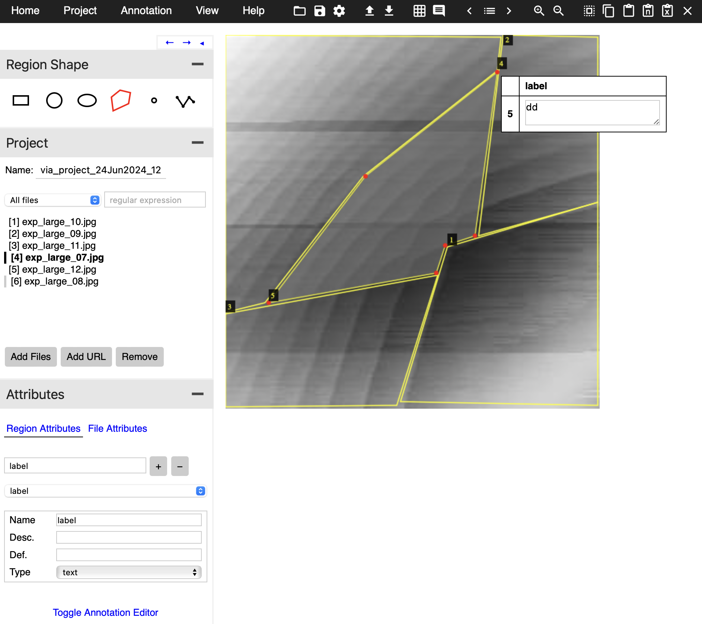

# custom-image-segmentation

This repository is an open source tool to build and train image segmentation models on custom data with the ability to inference existing models.

## Installation

In order to simplify the usage of this tool, it was designed around [Docker](https://www.google.com/search?client=safari&rls=en&q=docker&ie=UTF-8&oe=UTF-8). Please follow the instructions on their webstie to download Docker on your device.

Usage of Docker will ensure,
1. Intended functionality irrespective of OS version (MacOS, Windows, Linux)
2. All of the packages required will be properly installed inside the Docker container and will not interfere with any local installations

Once Docker is installed please follow the instructions below depending on the use case.

## Training a Custom Model

### 1. Construct your dataset

Organize your dataset in the project directory so that it has the following structure,

```
├── data
│   ├── train
│   │   ├── <train0>.jpg
│   │   ├── ...
│   │   ├── <trainX>.jpg
│   │   ├── annotations.json
│   ├── val
│   │   ├── <val0>.jpg
│   │   ├── ...
│   │   ├── <valY>.jpg
│   │   ├── annotations.json
│   ├── test
│   │   ├── <test0>.jpg
│   │   ├── ...
│   │   ├── <testZ>.jpg
│   │   ├── annotations.json
```

> Note: You will have to generate the annotations yourself; this can
be done easily through an online annotation tool such as [VGG Image Annotator](https://www.robots.ox.ac.uk/~vgg/software/via/via.html) and exporting it such that it follows standard formatting,



### 2. Design your configuration file

In addition to your dataset, you need a configuration file that tells detectron2 how to build and train your Mask-RCNN model. See the example below from [./examples/dot_configuration/configuration.yaml](./custom_image_segmentation/examples/dot_configuration/configuration.yaml).

```yaml
info:
    name: quantum dot configuration
    # Need to specify class dictionary for custom datasets,
    # 'nd' -> 'no dot'
    # 'ld' -> 'left dot'
    # 'cd' -> 'central dot'
    # 'rd' -> 'right dot'
    # 'dd' -> 'double dot'
    # Dictionary keys MUST match your annotations.json labels
    # Dictionary values can be anything as long as they are unique 
    classes: {"nd": 0, "ld": 1, "cd": 2, "rd": 3, "dd": 4}

hyperparameters:

    learning_rate: 2.0e-4
    num_epochs: 7000
    batch_num: 10
    batch_size_per_img: 128
```

### 3. Begin training your model

To begin training your model on your `data/train` folder, simply execute the following command,
```python
python train.py --config <configuration>.yaml 
```

> Note: Use `--help` to see all of the flags available to you.

### 4. Validate your model

In order to validate your model's performance, you can inference the model on the `data/val` folder. It is recommended to first do it interactively using the `src/inference.ipynb` notebook.

### 5. Test your model

With your model validated, you can inference the model on the `data/test` folder. It is recommended to first do it interactively using the `src/inference.ipynb` notebook.

## Inference Trained Model 

### 1. Prerequisites

Before running inference, you need to provide two files along with your image of interest,

1. `<model>.pth`: This file contains the trained model weights.

2. `configuration.yaml`: This file contains the _exact_ configuration settings that were used for the trained model you are trying to inference (see **Training** section).

3. `<image>.jpg`: This file is the image you wish to inference

### 2. Begin inferencing your image

To begin training simply execute the following command,
```python
python inference.py --model_weights <model>.pth --config <configuration>.yaml  --image <image>.jpg 
```

> Note: Use `--help` to see all of the flags available to you.

