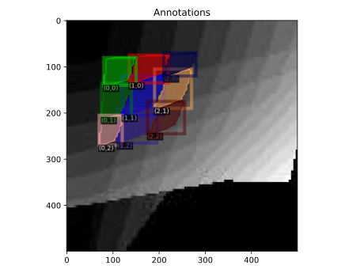
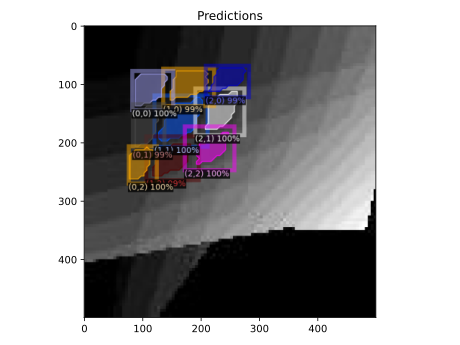
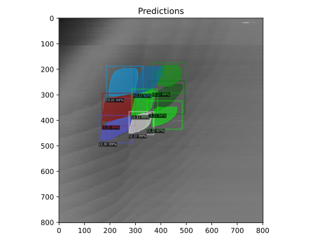

# Charge Configuration

This model takes in a [charge stability diagram](https://www.qutube.nl/machine-learning-for-semiconductor-quantum-devices/charge-stability-diagrams) specifically measured by a charge sensor (not direct current!) and is able to segment the image into the various dot charge states.

If you wish to recreate this model, follow the steps below to generate the custom dataset by processing the external [QFlow](https://data.nist.gov/od/id/66492819760D3FF6E05324570681BA721894) dataset from NIST. 

### 1. Download 

Begin by downloading the required datasets (*at least 15 GB required*),
```python
python src/download.py --version lite
```

>Note: Only the *lite* dataset from qflow has pre-defined charge states

### 2. Partition

Partition all of the `*.npy` files into `train`, `val` and `test` datasets with ratios defined by you,
```python
python src/partition.py --train 0.8 --val 0.1 --test 0.1
```

### 3. Image-ify

Convert each `*.npy` file found in `data/[train,val,test]` to the desired data type and then to the image,
```python
python src/convert_npy_to_jpg.py --data_type [sensor, current]
```

### 4. Annotate 

Annotate `train` and `val` datasets and organize it into the correct annotation format for `detectron2`,
```python
python src/annotate.py
```

### *Optional: Augment `data/train` Dataset*

You can optionally augment your created dataset in order to improve training,
```python
python src/augment.py --num_exp_aug 50 --num_sim_aug 2
```
this helps to bring balance to the dataset to increase the number of experimental data the model has access to.

### Example Training Data


### Inferencing a trained model

We can inference a random image in our validation dataset to see how the model compares,





Furthermore, it can be inferenced on a test image (experimental data),

