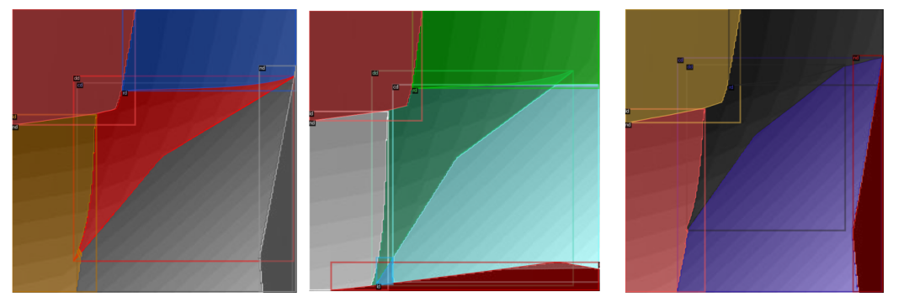
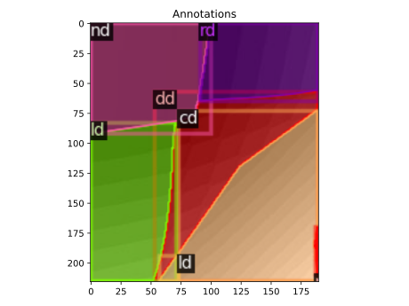
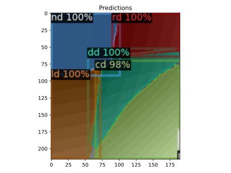
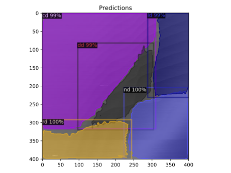

# Dot Configuration

This model takes in a [charge stability diagram](https://www.qutube.nl/machine-learning-for-semiconductor-quantum-devices/charge-stability-diagrams) and is able to segment the image into the various dot configurations.

If you wish to recreate this model, follow the steps below to generate the custom dataset by processing the external [QFlow](https://data.nist.gov/od/id/66492819760D3FF6E05324570681BA721894) dataset from NIST. 

### 1. Download 

Begin by downloading the required datasets (*at least 30 GB required*),
```python
python src/download.py --version both
```

### 2. Convert

Convert from `.hdf5` to `.npy` files (if applicable),
```python
python src/convert_hdf5_to_npy.py
```

### 3. Partition

Partition into `train`, `val` and `test` datasets,
```python
python src/partition.py --train 0.8 --val 0.1 --test 0.1
```

### 4. Image-ify

Convert each `.npy` file found in `data/[train,val,test]` to its respective image,
```python
python src/convert_npy_to_jpg.py --data_type [sensor, current]
```

### 5. Annotate 

Annotate `train` and `val` datasets,
```python
python src/annotate.py
```

### Example Training Data

Here is some example training data with their respective annotations.



### Inferencing a trained model

We can inference a random image in our validation dataset to see how the model compares,





Furthermore, it can be inferenced on a test image,

