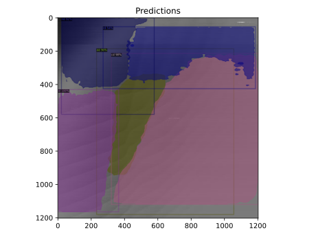

# Dot Configuration

This model takes in a [charge stability diagram](https://www.qutube.nl/machine-learning-for-semiconductor-quantum-devices/charge-stability-diagrams) and is able to segment the image into the various dot configurations based on the potential landscape of the device.

If you wish to recreate this model, follow the steps below to generate the custom dataset by processing the external [QFlow](https://data.nist.gov/od/id/66492819760D3FF6E05324570681BA721894) dataset from NIST. 

### 1. Download 

Begin by downloading the required datasets (*at least 30 GB required*),
```python
python src/download.py --version both
```

### 2. Convert

Convert from `*.hdf5` to `*.npy` files (applicable for `v2` version of QFlow),
```python
python src/convert_hdf5_to_npy.py
```

### 3. Partition

Partition all of the `*.npy` files into `train`, `val` and `test` datasets with ratios defined by you,
```python
python src/partition.py --train 0.8 --val 0.1 --test 0.1
```

### 4. Image-ify

Convert each `*.npy` file found in `data/[train,val,test]` to its respective image,
```python
python src/convert_npy_to_jpg.py --data_type [sensor, current]
```

### 5. Annotate 

Annotate `train` and `val` datasets by manipulating dot state information and organizing it into the correct annotation format for `detectron2`,
```python
python src/annotate.py
```

### *Optional: Augment `data/train` Dataset*

You can optionally augment your created dataset in order to improve training by making the model more robust to sources of "noise",
```python
python src/augment.py --num_exp_aug 50 --num_sim_aug 2
```
In the command above, for every experimental image in our dataset (`exp_*.jpg`), it will be augmented 50 times to create (`exp_*_augment[0-4].jpg`) and likewise for the simulated images. This helps make up for the lack of experimental images

### Example Training Data

Here is some example training data with their respective annotations.


### Inferencing a trained model

We can inference a random image in our validation dataset to see how the model compares,


Furthermore, it can be inferenced on a test image,



